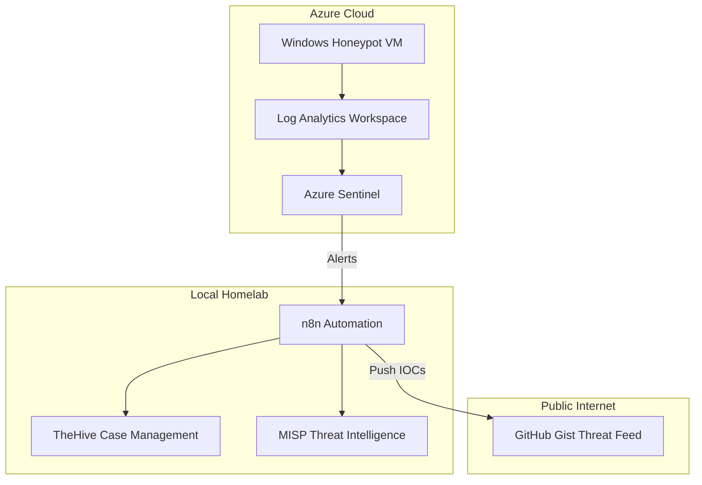

# Cloud-to-Ground: Hybrid Azure Honeypot & SOAR Integration

[](https://opensource.org/licenses/MIT)
[](https://azure.microsoft.com/en-us/products/microsoft-sentinel)
[](https://n8n.io/)

## Overview

What happens when you expose an RDP port to the internet? Within minutes, attackers from around the world start knocking.

This project deploys a deliberately vulnerable Windows VM in Azure as a honeypot, captures every failed login attempt, and automatically transforms that attack data into actionable threat intelligence. The real value isn't just watching attacks happen—it's building the automation pipeline that turns raw security events into a public blocklist that others can use.

**Live Threat Feed:** [View the current blocklist](https://gist.github.com/kyhomelab/eb6f58df93df4ea994b1a2a66d8610e6) — automatically updated by this project.

## Why I Built This

I wanted to bridge the gap between cloud security monitoring and local SOC operations. Most tutorials stop at "set up a SIEM and watch the logs." I wanted to go further:

- **Automate the boring parts** — No manual log reviews. Threats are detected, enriched, and pushed to a feed automatically.
- **Create something useful** — The public blocklist isn't just for show. It's a real threat feed anyone can consume.
- **Learn by doing** — Infrastructure as Code, KQL queries, API integrations, and workflow automation all in one project.

## Skills Demonstrated

- **Cloud Security** — Azure VM deployment, NSG configuration, Sentinel SIEM
- **Infrastructure as Code** — Bicep templates for reproducible deployments
- **Detection Engineering** — KQL queries for threat detection and visualization
- **SOAR/Automation** — n8n workflows connecting cloud alerts to local response
- **API Integration** — Azure AD authentication, GitHub API for threat feed publishing

## A Note on the Journey

This project didn't go smoothly on the first try. I originally built the automation layer using Shuffle SOAR, but ran into persistent stability issues that ate up hours of troubleshooting. Rather than force a broken tool to work, I migrated everything to n8n—which taught me an important lesson: sometimes the right move is knowing when to pivot. The [Troubleshooting doc](TROUBLESHOOTING.md) captures the real problems I faced and how I solved them.

## Architecture

The system connects three environments: Azure cloud infrastructure, a local homelab SOC, and a public GitHub Gist for threat sharing.



## Components

| Component | Purpose |
|-----------|---------|
| **Bicep Templates** | Infrastructure as Code—deploys the entire Azure environment in minutes |
| **Windows Honeypot VM** | Deliberately misconfigured (RDP exposed, firewall off) to attract brute-force attempts |
| **Azure Sentinel** | Cloud SIEM that ingests logs and runs detection queries |
| **n8n** | Local SOAR platform that orchestrates the automation pipeline |
| **GitHub Gist** | Public threat feed that shares attacker IPs with the community |

## Quick Start

If you want to deploy this yourself, here's the high-level flow:

1. **Prerequisites**: Azure subscription, Azure CLI, n8n instance (local or cloud)
2. **Deploy Infrastructure**: Run `az deployment group create` with `Azure/main.bicep`
3. **Configure Honeypot**: Execute `Azure/setup_honeypot.ps1` on the VM
4. **Enable Sentinel**: Connect Azure Sentinel to the Log Analytics Workspace
5. **Setup Automation**: Import `Automation/Cloud_Honeypot_IPs.json` into n8n
6. **Monitor**: Deploy the KQL queries and create a workbook for visualization

Detailed instructions for each phase are below.

---

## Setup Instructions

### Phase 1: Infrastructure Deployment

Instead of clicking through the Azure Portal, the entire environment deploys with a single command using Bicep.

**Prerequisites:**
- Azure CLI installed and authenticated (`az login`)
- A Resource Group created (e.g., `RG-Honeypot`)

**Deploy:**

Navigate to the `Azure/` folder and run:

```bash
az deployment group create \
  --resource-group RG-Honeypot \
  --template-file main.bicep \
  --parameters adminPassword='<YourSecurePassword>'
```

This creates the VM, virtual network, NSG with open RDP, and Log Analytics Workspace. The monitoring agent is installed automatically.

**Post-Deployment:**

Connect to the VM via RDP and run `setup_honeypot.ps1` to disable the Windows Firewall and NLA—making the honeypot properly "vulnerable."

**Enable Sentinel:**

In the Azure Portal, navigate to Microsoft Sentinel, click "Create," and select the workspace created by the Bicep deployment.

### Phase 2: Detection & Visualization

With logs flowing into Sentinel, the next step is building detection queries and visualizations.

#### Deploy KQL Queries

1. In Azure Sentinel, navigate to **Logs**
2. Paste the content of `Sentinel/failed_rdp_attempts.kql` and run it to verify data is flowing
3. Save the query for future use

#### Create the Attack Map Workbook

1. In Sentinel, go to **Workbooks** → **Add workbook**
2. Add a query block using the KQL from `Sentinel/failed_rdp_attempts.kql`
3. Set visualization to **Map**
4. Configure location settings using the `Geo` column (latitude/longitude)
5. Save the workbook

The workbook gives you a visual representation of where attacks are originating—surprisingly satisfying to watch populate in real-time.

### Phase 3: SOAR Integration

This is where the project gets interesting. Instead of manually checking logs, n8n automatically pulls data from Sentinel and pushes it to downstream systems.

#### Azure AD App Registration

n8n needs API access to query Sentinel. Set this up in Azure:

1. **Register an App**: Azure Portal → Microsoft Entra ID → App registrations → New registration
   - Name it something like `n8n-Sentinel-API`
   - Note the `Application (client) ID` and `Directory (tenant) ID`

2. **Create a Client Secret**: Certificates & secrets → New client secret
   - Copy the value immediately (you won't see it again)

3. **Assign Permissions**: Go to your Log Analytics Workspace → Access control (IAM)
   - Add role assignment: `Log Analytics Reader` → assign to your app

#### n8n Workflow Configuration

The workflow runs on a schedule (I use 10 minutes) and performs these steps:

1. **Get Azure Token** — POST to `https://login.microsoftonline.com/<TENANT_ID>/oauth2/token`
2. **Query Sentinel** — Use the token to run KQL against the Log Analytics API
3. **Process Results** — Format the data for output
4. **Update Gist** — Push the formatted blocklist to GitHub

The full workflow is exported in `Automation/Cloud_Honeypot_IPs.json`—import it into n8n and update the credentials.

### Phase 4: Public Threat Feed

The final piece: turning your honeypot data into a community resource.

**Live Feed:** [https://gist.github.com/kyhomelab/eb6f58df93df4ea994b1a2a66d8610e6](https://gist.github.com/kyhomelab/eb6f58df93df4ea994b1a2a66d8610e6)

#### Setup Steps

1. **Create a GitHub Gist**: Create a public gist named `honeypot_blocklist.txt`
2. **Generate a PAT**: Create a Personal Access Token with `gist` scope
3. **Configure n8n**: Add the GitHub credential and Gist ID to the workflow

The n8n workflow handles formatting and updates automatically. Every 10 minutes, fresh attacker IPs are pushed to the public feed.

---

## Technical Reference

### n8n Code Blocks

These are the key code snippets used in the n8n workflow.

#### Code Node: Format IP List

Transforms raw Azure JSON into a readable blocklist format:

```javascript
const rows = items[0].json.tables[0].rows;

const ipList = rows.map(row => {
    const ip = row[0];
    const country = row[1] || "Unknown";
    const city = row[2] || "Unknown";
    const count = row[3];

    return ip.padEnd(16) + " | " + country.padEnd(15) + " | " + city.padEnd(15) + " | Attempts: " + count;
}).join('\n');

const header = "# Cloud Honeypot Threat Feed\n# Generated: " + new Date().toISOString() + "\n# Total Unique Attackers: " + rows.length + "\n\n";
const columnHeaders = "IP ADDRESS       | COUNTRY         | CITY            | ATTACK VOLUME\n----------------------------------------------------------------------\n";

const fileContent = header + columnHeaders + ipList;

return [{ json: { fileContent: fileContent } }];
```

#### HTTP Request Node: Update GitHub Gist

```javascript
{{
JSON.stringify({
  "files": {
    "honeypot_blocklist.txt": {
      "content": $json.fileContent
    }
  }
})
}}
```

### KQL Queries

Three queries power different parts of the system:

#### 1. Failed RDP Visualization

Used for the Sentinel workbook and attack mapping:

```kql
SecurityEvent
| where EventID == 4625
| extend IpAddress = tostring(parse_json(tostring(ParameterXml.sys.EventData.Data))['IpAddress'])
| extend Account = tostring(parse_json(tostring(ParameterXml.sys.EventData.Data))['TargetUserName'])
| where isnotempty(IpAddress) and isnotempty(Account)
| summarize FailedCount = count() by IpAddress, Account, bin(TimeGenerated, 5m)
| extend Geo = geo_info_from_ip_address(IpAddress)
| project TimeGenerated, Account, IpAddress, FailedCount, Country=Geo.country, State=Geo.state, City=Geo.city
| order by TimeGenerated desc
```

#### 2. Geo-Enriched Blocklist (30-Day)

Powers the public threat feed with comprehensive historical data:

```kql
SecurityEvent
| where EventID == 4625
| where TimeGenerated > ago(30d)
| where isnotempty(IpAddress)
| extend Geo = geo_info_from_ip_address(IpAddress)
| summarize FailedCount = count() by IpAddress, Country = tostring(Geo.country), City = tostring(Geo.city)
| where FailedCount > 5
| order by FailedCount desc
```

#### 3. High-Frequency Attack Detector

Near real-time alerting for active attacks:

```kql
SecurityEvent
| where EventID == 4625
| where TimeGenerated > ago(10m)
| where isnotempty(IpAddress)
| summarize FailedCount = count() by IpAddress
| where FailedCount > 5
```

---

## Screenshots

Visual documentation is organized in the [Pictures/](Pictures/) directory.

## Troubleshooting

Hit a wall during deployment? I probably hit the same one. See [TROUBLESHOOTING.md](TROUBLESHOOTING.md) for solutions to:

- VM size availability errors in Azure regions
- Public IP SKU compatibility issues
- Shuffle stability problems (and why I switched to n8n)
- Azure AD authentication configuration

## What I Learned

Building this project reinforced a few key lessons:

- **Automation pays off** — The upfront investment in n8n workflows means I never manually review logs. The system runs itself.
- **Pivot when necessary** — Shuffle looked great on paper but didn't work in practice. Recognizing when to switch tools saved hours of frustration.
- **Real data beats simulations** — Within hours of deployment, real attackers were hitting the honeypot. There's no substitute for actual threat data.
- **Documentation matters** — Writing the troubleshooting guide while problems were fresh made this repo actually useful for others (and future me).

## Future Improvements

- Integrate with TheHive for automated case creation on high-severity attacks
- Add MISP integration to correlate with known threat intelligence
- Build a dashboard showing attack trends over time
- Experiment with different honeypot services beyond RDP

## Repository Structure

```
cloud-honeypot/
├── Azure/
│   ├── main.bicep              # Infrastructure as Code
│   └── setup_honeypot.ps1      # VM configuration script
├── Automation/
│   └── Cloud_Honeypot_IPs.json # n8n workflow export
├── Sentinel/
│   ├── failed_rdp_attempts.kql
│   ├── geo_enriched_blocklist.kql
│   └── high_freq_attack_detector.kql
├── Workbooks/
│   └── attack_map_workbook.json
├── Pictures/                   # Project screenshots
├── LICENSE
├── README.md
├── SECURITY.md
└── TROUBLESHOOTING.md
```

## License

This project is licensed under the MIT License. See [LICENSE](LICENSE) for details.
